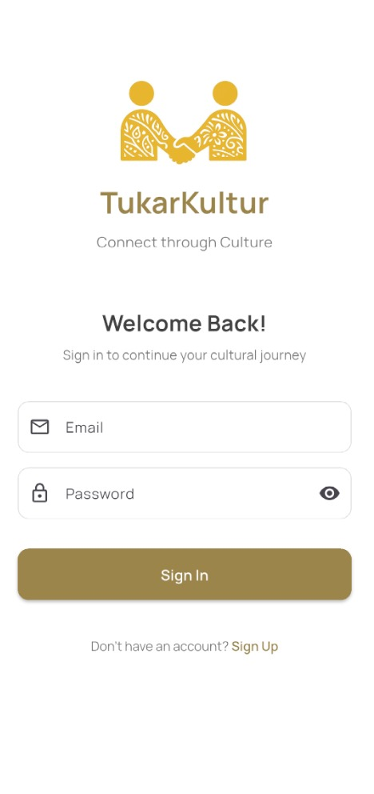
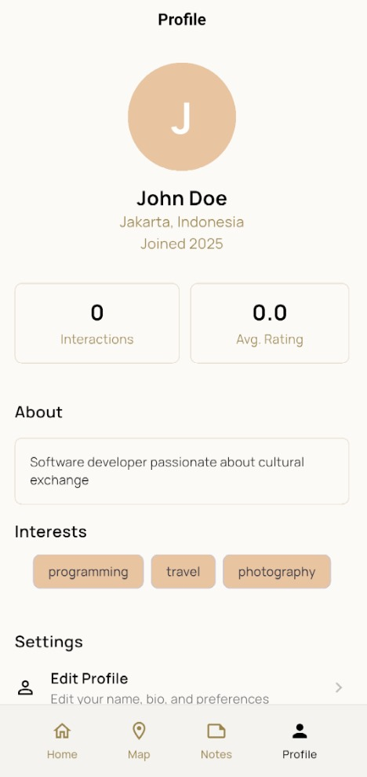

## Inspiration
Every little thing makes up a person's identity, and everyone has a piece to share. 

The collective identity of a society makes up a culture which is often attributed to regions. 
Every individual is a collection of cultures and a piece of them is left in everyone they meet. From interactions, cultures spread. From this, the best way to learn a culture is through its people, through strangers. 

## What it does
`TukarKultur` let strangers meet. `TukarKultur` lets users interact with other users with a live calculation of users' positions.  When two users are within a parameter, a possibility to chat with each other is opened up. Users then can chat and plan to meet. From those meetings, users can exchange their knowledge of their cultures. Strangers users meet within a region may be a local with in depth knowledge of the local culture.

After each meeting, users may post a note of their encounters with different strangers and share it with their friends. Users may also add the strangers as their new friend to share their future encounters!

`TukarKultur` also lets users input their cultural heritage data. With this data, a **Culture AI** summarizes and provides additional informations of the user's culture to help strangers they meet learn more about their culture.

## How we built it
`TukarKultur` is built for mobile with Flutter to provide a clean and functional user interface emulated on Android Studio for development. This interface allows users to create and log into their accounts. By periodically uploading the user's location to the server, `TukarKultur` calculates the distance between users and shows them users that are within 5 KM from them. Users may then choose to start a chat with those other users and plan a meeting with each other.

After each encounters, users may then upload a post about it. Each posts may contain a summary and pictures on what they learned from this little cultural exchange.

User data, posts, and other forms of data is connected and managed by a RESTful API server run with Golang with the Gin Web Framework for a quick and simplistic lightweight server hosted on Vercel to connect with a PostgreSQL database hosted in NeonDB. The same server also runs a concurrent Goroutine that manages Websocket connections for live chat interractions. 

Culture AI is driven by the OpenAI API to be used as summarizer for an AI driven experience.

## Challenges we ran into
Managing an app that consistently checks each users positions come with its own challenges. Live connection with Websocket must be managed carefully for efficient and safe connections. Having an underpolished plan made it difficult in to systematically create the application in a short time constraint. Managing synchronousity of works in the team was also challenging since we had to divide the tasks on the fly.

## Accomplishments that we're proud of
We managed to manage users locations with periodic asynchronous updates to the server. The server then calculates O(n) distances to check users that are within a perimeter. 
End users may start a chat by sending a request that is upgraded into a live Websocket connection between both clients and the server for a quick and responsive chat. 

## What we learned
We learned to design and create a mobile app with Flutter in a short amount of time. On the server side, we learned to use Golang to create backend with easily streamlined development with fast compilation and incredibly stable runtime. Golang makes it easy to manage concurrency with its Goroutine and open up Websocket connections.

We learned to plan and manage our project as a team better for the future. Carefully detailed and complete spesifications would be great to easily plan apps and not get overwhelmed even in short amounts of time.

## What's next for TukarKultur
We hope `TukarKultur` can create meaningful connections with strangers and make small but meaningful cultural exchanges.

## Screenshots

### Home Screen

### Login

### Profile

### Map View

### Chat and Review

### Notes and Memories

### Notes

### Allow Access

### AI Features
